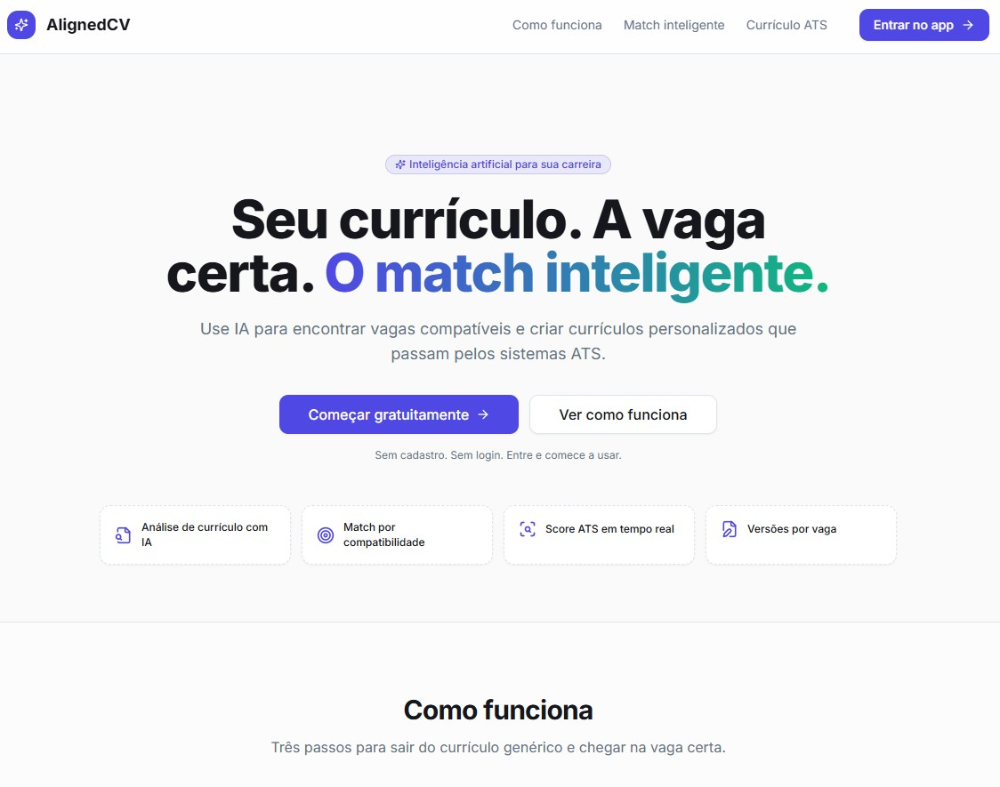
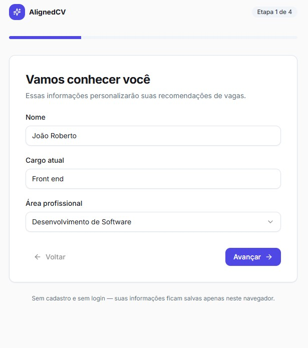
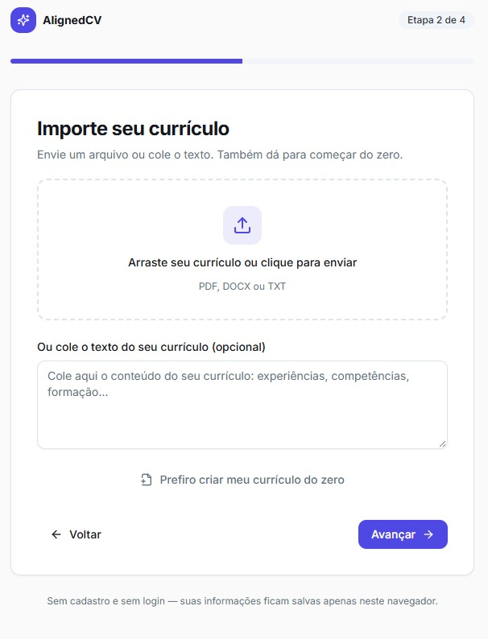
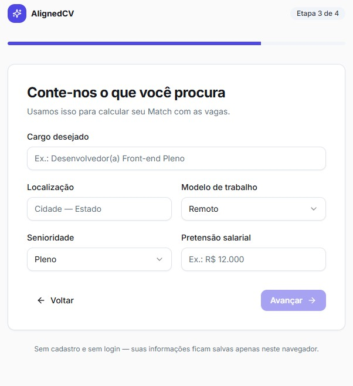
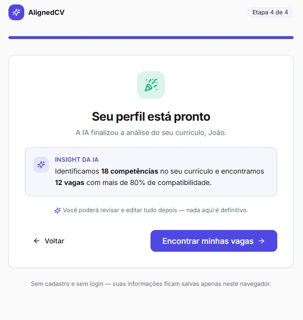

# AlignedCV

Plataforma inteligente de **matchmaking entre candidatos e vagas**: a IA analisa seu perfil,
compara com vagas, explica a compatibilidade e gera currículos otimizados para **ATS**.

## Screenshots

### 1. Landing page



### 2. Onboarding — Vamos conhecer você (etapa 1 de 4)



### 3. Onboarding — Importe seu currículo (etapa 2 de 4)



### 4. Onboarding — Conte-nos o que você procura (etapa 3 de 4)



### 5. Onboarding — Seu perfil está pronto (etapa 4 de 4)



## Stack

- Vite + React + TypeScript
- Tailwind CSS + shadcn/ui (design system)
- Zustand (estado global + persistência local)
- @dnd-kit (Kanban de candidaturas)
- Camada `AIService` com provider mockado (pronta para plugar GLM, Claude, OpenAI...)

## Rodando

```bash
npm install
npm run dev
```

Abra http://localhost:5173

## Estrutura

```
src/
  components/   ui/, layout/, common/, jobs/, resume/, match/, ats/, ai/, applications/, dashboard/
  pages/        Landing, Onboarding, Dashboard, Jobs, JobDetails, MyResume, Resumes,
                ResumeEditor, ATSAnalyzer, Applications, Profile, Settings
  lib/          utils, mock-data/, ai/, engines/ (matching + ATS)
  stores/       useAppStore, useUiStore
  hooks/        use-theme, use-ai-process
  types/        modelos de domínio
```

MVP sem autenticação: os dados ficam salvos no navegador (localStorage) e podem ser
limpados em Configurações → Privacidade.
